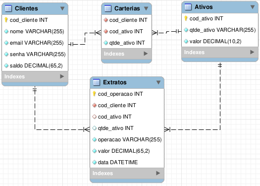
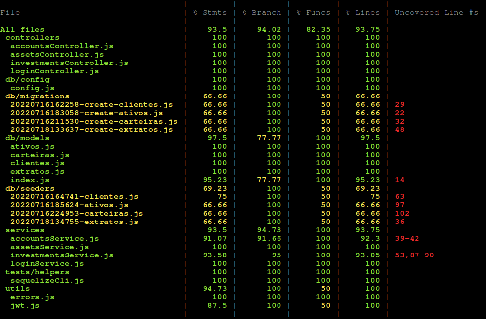

### Olá, esse é o repositório do meu desafio técnico do processo seletivo XP/Trybe. Seja bem-vind@!

Nesse projeto foi desenvolvida uma aplicação backend seguindo os critérios solicitados no desafio com alguns aprimoramentos. 

A aplicação foi desenvolvida em NodeJS utilizando a linguagem javascript. Para a criação do servidor HTTP foi utilizado o framework Express e a conexão com o banco de dados foi intermediada pela ORM Sequelize. Os detalhes sobre as minhas tomadas de decisão e desafios enfrentados estão relatados nas seções a seguir. 

<br />
<details>
  <summary><strong>💻 Tecnologias e bibliotecas utilizadas</strong></summary>
  
  > Segue abaixo a relação de todas as tecnologias e bibliotecas utilizadas. Detalhes sobre as funções e motivações de escolha serão explicadas ao longo das próximas seções.  

  - NodeJs
  - Express
  - Sequelize
  - Http-status-code
  - Node MySQL2
  - Node-postgres
  - ExpressJS Async Errors
  - JSON Web Token Authentication
  - Shelljs
  - Bcrypt-nodejs
  - Dotenv
  - Joi
  - Swagger
  - Docker
  - ESLint
  - Nodemon
  - Mocha
  - Chai
  - Sinon
  - Nyc

  <br/>
</details>

<details>
  <summary><strong>🔧 Instalação e execução</strong></summary>
  
> A execução do projeto pode ser realizada de duas formas:

  #### 👉 Sem Docker
>1. Clone o repositório: `git clone git@github.com:venturinn/desafio-tecnico-xp-inc.git`.

>2. Instale as dependências: `npm install`.

>3. Disponibilize um servidor MySQL ou outro compatível com o ORM Sequelize.
>4. Crie um arquivo .env na raiz do repositório e configure as variáveis de ambiente com as credenciais do seu banco de dados, a porta do servidor e o segredo do JWT. _As variáveis de ambiente necessárias podem ser consultadas no arquivo .env.example._
>5. Crie as tabelas e as popule executando os seguintes comandos: `npm run db-create`, `npm run db-migrate` e `npm run db-seed`.

>6. Inicie a aplicação com o comando: `npm start`.

:warning: Essa opção possui como pré-requisito a instalação do NodeJS e um servidor MySQL rodando na máquina.

#### 👉 Com Docker

>1. Clone o repositório: `git clone git@github.com:venturinn/desafio-tecnico-xp-inc.git`.

>2. Rode o container que possui o servidor MySQL com seguinte comando: `docker-compose -f docker-compose-db.yml up`.

>3. Rode o container que possui a aplicação Node com seguinte comando: `docker-compose -f docker-compose-node.yml up`.

:warning: Para essa opção não é necessário configurar as variáveis de ambiente, criar as tabelas e executar a aplicação, tudo ocorrerá de forma automática, porém é importante se certificar que o serviço MySQL já esteja up antes de executar o container da aplicação.

  <br/>
</details>

<details>
  <summary><strong>🗂️ Arquitetura</strong></summary>
  
> O projeto foi estruturado seguindo a arquitetura MSC, com a separação do código principal entre as camadas de controladores, serviços e modelos.

> O projeto ficou organizado da seguinte forma:
  
  ```tree
src
|
|
├─ controllers
|      ├─ accountsController.js
|      ├─ assetsController.js
|      ├─ investmentsController.js
|      └─ loginController.js
|
├─ db
|     ├─ config 
│          └─ config.js
|     ├─ migrations
│          ├─ 20220716162258-create-clientes.js
│          ├─ 20220716183058-create-ativos.js
│          ├─ 20220716211530-create-carteiras.js 
│          └─ 20220718133637-create-extratos.js
|     ├─ models
│          ├─ index.js
│          ├─ ativos.js
│          ├─ carteiras.js 
│          ├─ clientes.js 
│          └─ extratos.js
|     ├─ seeders
│          ├─ 20220716164741-clientes.js
│          ├─ 20220716185624-ativos.js
│          ├─ 20220716224953-carteiras.js
│          └─ 20220718134755-extratos.js
|  
├─ docs
|     └─ swaggerConfig.json
|  
├─ middlewares
│     ├─ accountTransactionValidate.js
│     ├─ assetTransactionValidate.js
│     ├─ authenticationValidate.js   
│     ├─ authorizationValidate.js
│     ├─ error.js
│     ├─ index.js
|     └─ loginValidate.js
| 
├─ routers
│     ├─ accounts.js
│     ├─ assets.js
│     ├─ index.js   
│     ├─ investiments.js
|     └─ login.js  
| 
├─ services
│     ├─ accountsService.js
│     ├─ assetsService.js
│     ├─ investmentsService.js  
|     └─ loginService.js
|    
├─ tests
|     ├─ controllers
│          ├─ accountsController.test.js
│          ├─ assetsController.test.js
│          ├─ investmentsController.test.js 
│          └─ loginController.test.js
|     ├─ services
│          ├─ accountsService.test.js
│          ├─ assetsService.test.js
│          ├─ investmentsService.test.js 
│          └─ loginService.test.js
|     └─ helpers
│          └─ sequelizeCli.js
│ 
├─ utils
|     ├─ errors.js
│     └─ jwt.js
│  
├─ app.js
│
├─ index.js
│  
└─ routes.js   
```
  <br/>
</details>

<details>
  <summary><strong>🗄️ Banco de dados</strong></summary>
  
> Por uma questão de familiaridade, optei pela utilização do ORM `Sequelize`. Esse ORM oferece muitas facilidades no desenvolvimento, entre as principais se destaca a possibilidade de realizar a migração do banco de dados sem profundas alterações no código. Esse recurso permitiu que eu usasse um servidor `MySQL` durante o desenvolvimento e migrasse para o banco `Postgres` no deploy da aplicação. Outro recurso importante foi a criação de transações atômicas quando uma solicitação depende da gravação de dados em mais de uma tabela, garantindo assim a consistência do banco. 

> O normalização do banco foi realizada com 04 tabelas: `Clientes`, `Ativos`, `Carteira` e `Extrato`.

> Diagrama de Entidade-Relacionamento:
  
  

> Destaco a criação de uma tabela de ligação para armazenar os dados da carteira de ativos dos clientes, garantindo assim um relacionamento N:N entre a tabela `Ativos` e a tabela `Clientes`. Para essa tabela denominada `Carteira`, utilizei duas chaves estrangeiras compondo uma chave primária composta, bloqueando assim a possibilidade de duplicidades.

> O desafio não previa o armazenamento do histórico das transações, no entanto, por serem informações sensíveis, a tabela `Extrato` foi criada para armazenar o histórico de compra e venda de ativos e depósitos e saques de recursos.

  <br/>
</details>

<details>
  <summary><strong>🚨 Segurança</strong></summary>
  
*Autenticação:*
  
> A aplicação possui autenticação `JWT`, portanto, antes de acessar as rotas é necessária a solicitação de um JSON web token na rota `/login` e para o acesso à todas as outras rotas um token válido deve ser enviado no campo Authorization do header.

*Autorização:*
  
> Com exceção da rota /login, em todas as outras rotas um middleware de autorização foi aplicado. Esse middleware verifica se o código do cliente enviado nos parâmetros e body das requisições corresponde com o código do cliente que está armazenado no payload do JSON web token enviado junto com as requisições. Em caso de não correspondência, uma mensagem de erro de autorização é retornada.

*Armazenamentos de senhas:*
  
> A senha dos clientes é armazenada no banco de dados com criptografia hash, para isso foi utilizada a biblioteca `bcrypt-nodejs`.

  <br/>
</details>

<details>
  <summary><strong>🐋 Dockerização</strong></summary>
  
  > O projeto pode ser implementado facilmente utilizando container Docker. Para isso, criei um arquivo Dockerfile para a criação da imagem da aplicação, dois arquivos docker-compose e um arquivo .sh para armazenar os comandos de criação do banco e inicialização do servidor Node.

  > O arquivo `docker-compose-db.yml` possui as instruções para criação do container do banco de dados MySQL e o arquivo `docker-compose-node.yml` possui   as instruções para o build da aplicação, as variáveis de ambiente e o comando para a criação das tabelas e inicialização do servidor. 

  > E por que não utilizar um único arquivo docker-compose para orquestrar os dois containers ⁉️

  > Aqui cabe o relato de uma dificuldade importante que tive durante o processo de dockerização da aplicação. Mesmo utilizando a configuração de `Depends_on`, o container da aplicação "sobe" antes do banco de dados expor a porta de comunicação (3306) no seu respectivo container. Esse atraso do  servidor MySQL compromete a criação das tabelas, pois os comandos acabam sendo executados quando o banco ainda está down. Para contornar esse problema, optei pela criação de dois docker-compose separados, com isso, são necessários dois comandos, um para subir o container do MySQL e outro para subir o container da aplicação Node.
  
  <br/>
</details>

<details>
  <summary><strong>✅ Testes Unitários</strong></summary>
  
 > A aplicação possui a seguinte cobertura de testes unitários:
  
 
  
 > Para completar 100% de cobertura estão pendentes de testes as funções de reverter (undo) as migrations e as seeds do ORM Sequelize e o teste da função rollback das transações do banco. A função rollbak apenas é executada caso o banco apresente falha que impeça a conclusão da operação em alguma das tabelas.
 
 > Os testes podem ser rodados por meio do comando `npm test`. Para a implementação foram utilizadas as bibliotecas: `Mocha`, `Chai` e `Sinon` e por meio da biblioteca `Nyc` é possível averiguar a cobertura utilizando o comando `npm run test:coverage`.
 
 > O Sequelize disponibiliza a possibilidade de utilização em 3 diferentes ambientes: `development`, `test` e `production`. Com esse recurso, optei por não mochar o banco de dados e utilizar um banco próprio para testes. Para isso, configurei no package.json o comando npm test para alterar a variável de ambiente `NODE_ENV` para test antes de iniciar os testes. Para que não ocorra interferência entre os testes, a utilização de um banco real no ambiente de testes exige que o banco seja reiniciado entre os testes, para isso utilizei a biblioteca  `Shelljs`, que fornece recursos para execução de comandos do Shell em JavaScript.
  
  <br/>
</details>
  
<details>
  <summary><strong>🚀 Deploy</strong></summary>
  
 > O deploy da aplicação foi realizado na plataforma [Heroku](https://dashboard.heroku.com/) por meio de um container Docker utilizando a imagem Alpine, que é considerada uma distribuição leve do Linux e atendeu perfeitamente a minha aplicação. Para o deploy utilizei um banco de dados Postgree fornecido pela plataforma [Supabase](https://supabase.com/).

 > Para facilitar o deploy de novas features, habilitei a implantação contínua da minha aplicação (CD) com a branch main desse repositório. 
  
 > Os endpoints em deploy pode ser consultados no seguinte endereço: https://venturin-xp.herokuapp.com/docs/
  
  <br/>
</details>

<details>
  <summary><strong>📃 Documentação</strong></summary>
  
 > A API e todos os seus endpoints foram documentados com o `Swagger` e podem ser acessados no seguinte endereço:

 >  https://venturin-xp.herokuapp.com/docs/

 > Para todas as rotas foram descritos o formato do body e parâmetros que devem ser utilizados nas requisições e o formato das respostas esperadas. Outro recurso interessante do `Swagger` é a possibilidade de realizar requisições reais para testar a API. Para o testes de todas as rotas, primeiramente é necessário acessar a rota `/login` e solicitar o token que deve ser preenchido no campo `Authorize`. 

  Para o login de teste, utilizar as credenciais do usuário id `77777`: 
  
```json
  { 
    "email": "cliente@email.com", 
    "senha": "723456" 
  }
  ```

 > URL: https://venturin-xp.herokuapp.com
  
 > Endpoins:
  
 > /login
  
 > /investimentos/comprar
  
 > /investimentos/vender
  
 > /ativos/{id}
  
 > /conta/ativos/{id}  
  
 > /conta/deposito  
  
 > /conta/saque
  
 > /conta/{id}  
  
  <br/>
</details>


<details>
  <summary><strong>🆙 Aprimoramentos</strong></summary>
  
> Ao longo do desenvolvimento realizei duas alterações no contrato de serviços:

- No contrato de serviço temos dois padrões diferentes de linguagem: PascalCase e camelCase. Para melhorar a padronização do projeto, optei por usar camelCase na requisição e resposta de todos os endpoints.

- O contrato de serviço prevê que o código do ativo seja do tipo inteiro. Para me aproximar mais da realidade do mercado financeiro, alterei o padrão para string, assim foi possível desenvolver o projeto utilizando o ticker de ativos reais.

  
  <br/>
</details>

<details>
  <summary><strong>📈 Simulação do mercado de capitais</strong></summary>
  
> As operações de compra e venda de ativos financeiros do projeto utilizaram simplificações em comparação com o mercado de capitais real:

- No mercado real, as operações de compra e venda podem ser registradas no book de oferta com o preço definido pelo cliente ou podem ser registradas a mercado, sem a definição de preço pelo cliente. O meu projeto contempla apenas a opção de compra/venda a mercado. 

- Quanto à liquidez dos ativos, foi considerado que o mercado possui liquidez garantida para a venda de ativos pelo cliente e para a realização de compras a liquidez dependerá da quantidade de ativos disponíveis na corretora. 

- Não foram contempladas diferenças entre o mercado padrão e o mercado fracionário.

- Foi utilizada a mesma cotação para vendas e compras fornecida pela tabela Ativos. Essa simplificação considerou que o spread entre o preço de compra e o de venda é igual a zero.

  <br/>
</details>


<br/>
Projeto desenvolvido por Diego Venturin. 😉